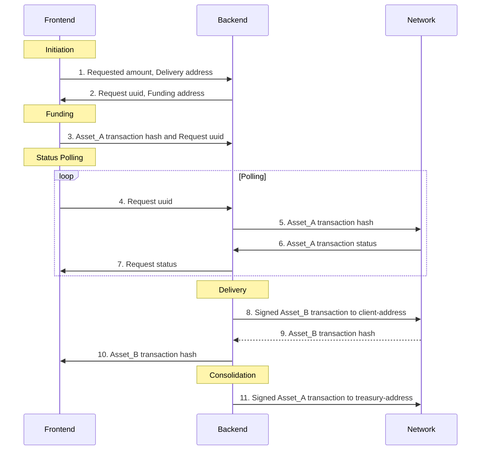

# Remitt Tokenizer Service

API-backend service for USDT<-->USDR TRC20 tokenization and redemption bridge.

## Definitions

- USDT: a smartcontract token supported by Tether [deployed on the Tron blockchain](https://tronscan.io/#/contract/TR7NHqjeKQxGTCi8q8ZY4pL8otSzgjLj6t/code)
- USDR: a smartcontract token supported by Remitt [deployed on the Tron blockchain](https://tronscan.io/#/contract/TFFxGGpVqxCDvo6upD3od5dFNtiRMv4Hc4/code)
  - Backend service should possess the ability to mint and burn tokens of USDR. This can be accomplished by providing the Tron account operated by the Backend with MINTER and BURNER roles.
- Backend: Remitt Tokenizer Service.
- User: a user of the frontend application.
- Frontend: web application that interacts with the Backend.
- Tokenization: a process of converting USDT to USDR.
- Redemption: a process of converting USDR to USDT.
- Consolidation: a process of consolidating assets on a single blockchain account - Treasury Account - to simplify asset management.

## General description

The service provides API endpoints for web3-compatible frontend application. 
The frontend application is not a part of the service.

### Use-case

The end-user can use the service to:
- Tokenize USDT to USDR tokens;
- Redeem USDR to USDT tokens.

### User's scenario

#### Tokenization process

1. User opens a web3-compatible frontend application in the browser with TronLink extension installed and configured.
2. User clicks the "Tokenize" button.
3. User enters the amount of USDT tokens to tokenize
4. User clicks the "Proceed" button.
5. The frontend application initiates a USDT transaction by invoking TronLink extension to sign the transaction.
6. The frontend application waits for the transaction to be confirmed.
7. The frontend application starts polling the transaction status from the Tokenizer Service.
8. As soon as the transaction status is "SUCCESS", the frontend application displays the USDR transaction hash.

#### Redemption process

Is the same as the tokenization process, but instead of USDT frontend application uses USDR and instead of USDR frontend application uses USDT.

## Operation sequence

Tokenize and Redeem requests are very similar to each other.
The only difference is what kind of asset is used in Funding and Delivery stages. 
During the Delivery stage, the service transfers the received asset from Funding Address to Treasury Address.

### Frontend-Service interaction sequence diagram

- For tokenization: Asset A = USDT, Asset B = USDR
- For redemption: Asset A = USDR, Asset B = USDT



### Sequence steps annotation

1. Frontend sends amount and deliver address to Backend.
2. Backend sends uuid and funding address to Frontend.
3. Frontend sends uuid and asset_A transaction hash to Backend.
4. Frontend starts polling the transaction status from the Backend.
5. Backend queries status of Asset_A transaction hash to Network.
6. Network replies with Asset_A transaction status to Backend.
7. Backend replies with status to Frontend.
8. Backend sends signed Asset_B transaction to Network.
9. Network replies with Asset_B transaction hash to Backend.
10. Backend replies with Asset_B transaction hash to Frontend.
11. Backend sends signed Asset_A transaction to Network.

## API Endpoints

### Tokenization Initiation

```http request
POST /tokenize
Content-Type: application/json

{
    "amount": "1",
    "clientAddress": "T..."
}
```

#### Response

```json
{
    "uniqueAddress": "T...",
    "uuid": "..."
}
```

### Tokenization Funding

```http request
POST /tokenize/funding
Content-Type: application/json

{
    "transactionHash": "0x...",
    "uuid": "..."
}
```

### Tokenization Status Polling

```http request

GET /tokenize/status/{uuid}
```

#### Response

```json
{
    "status": "SUCCESS",
    "transactionHash": "0x..."
}
```

### Redemption Initiation

```http request
POST /redeem
Content-Type: application/json

{
    "amount": "1",
    "clientAddress": "T..."
}
```

### Redemption Funding

```http request
POST /redeem/funding
Content-Type: application/json

{
    "transactionHash": "0x...",
    "uuid": "..."
}
```

### Redemption Status Polling

```http request
GET /redeem/status/{uuid}
```

## Blockchain Network Interaction

### Tron Network Library

## Considerations

### Anti-Spam

Service does not check if the client address is a valid Tron address.
It is possible to send requests to the service with fake addresses.
It is recommended to implement anti-spam mechanism, such as reCaptcha, in the future versions.
